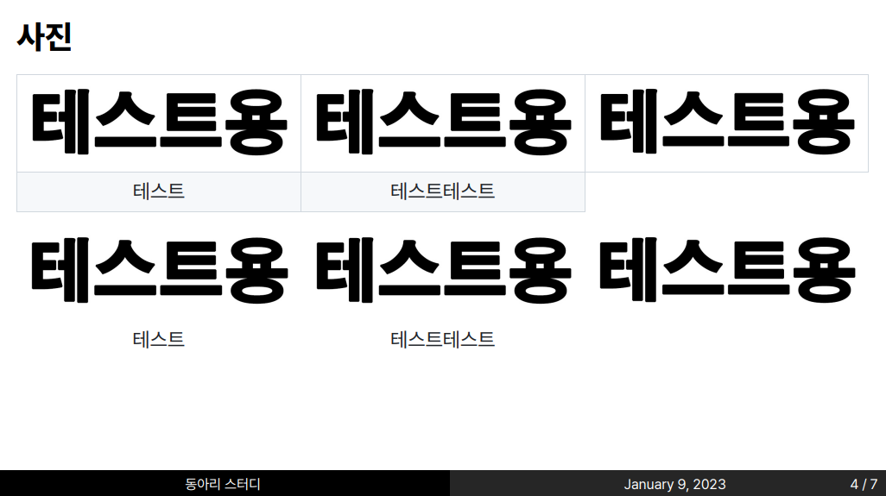

## marp-black-white

## Usage

Install <a href="https://marketplace.visualstudio.com/items?itemName=marp-team.marp-vscode">Marp for VS Code</a>

Enable `Markdown > Marp: Enable HTML`

Add `Markdown > Marp: Themes`

`https://raw.githubusercontent.com/hyuunnn/marp-black-white/main/css/black-white.css`

## Thanks

<a href="https://github.com/kaisugi/marp-theme-academic">kaisugi - marp-theme-academic</a>
